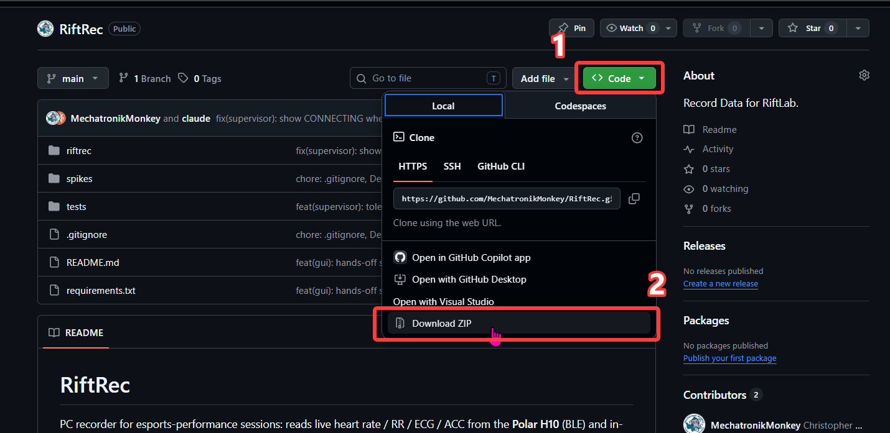
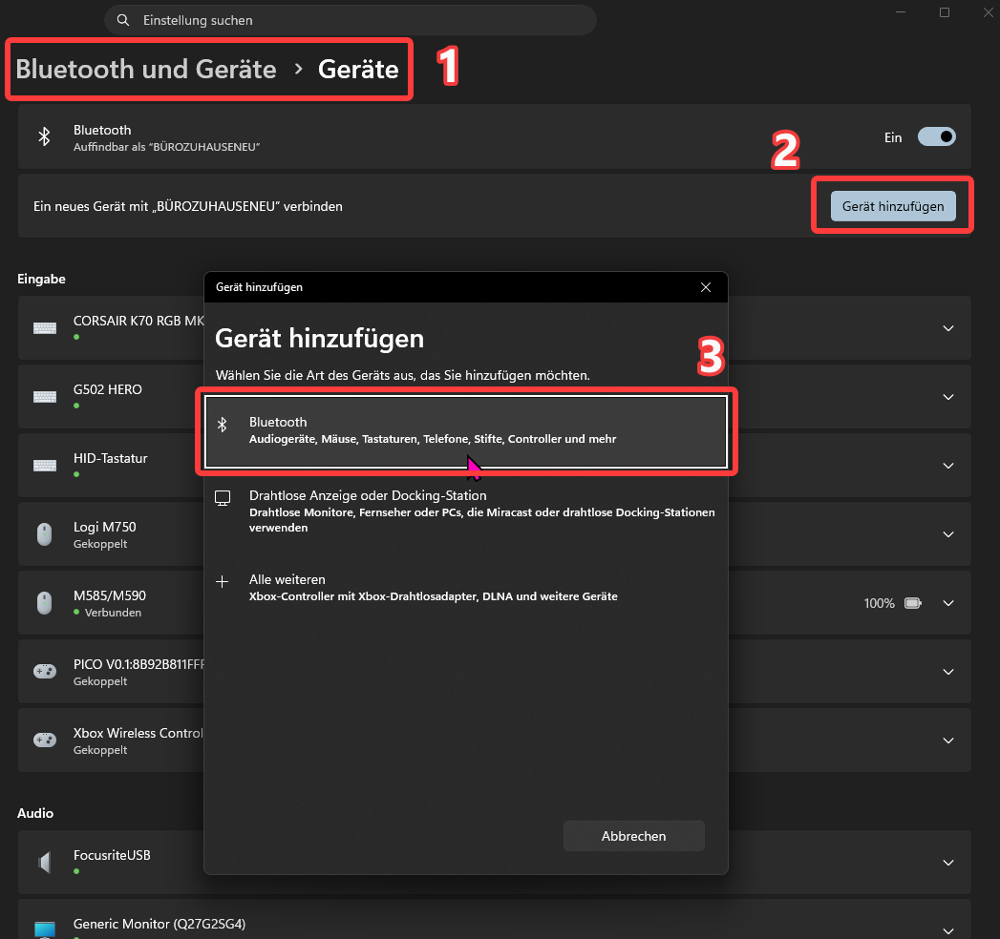
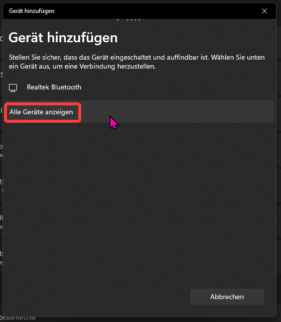
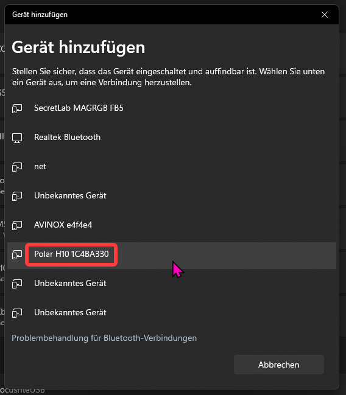
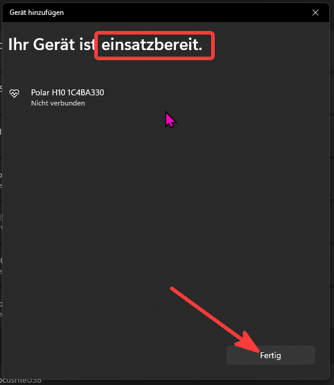
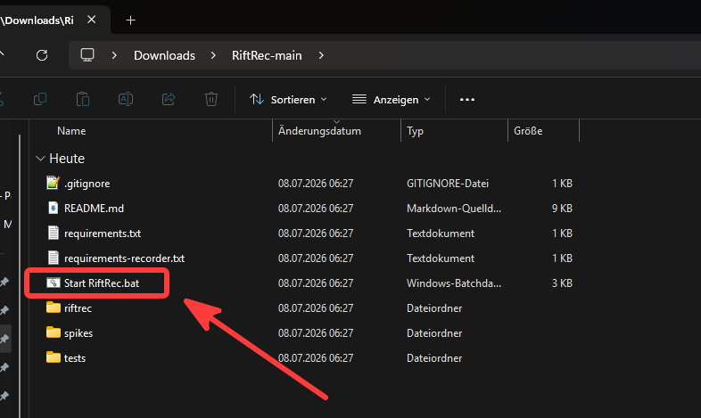
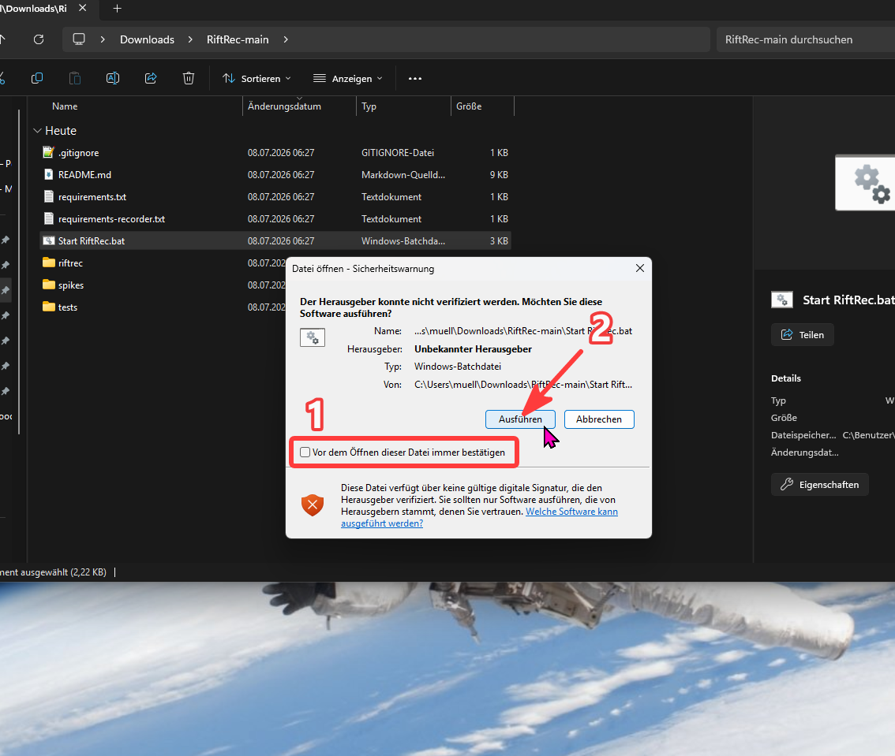
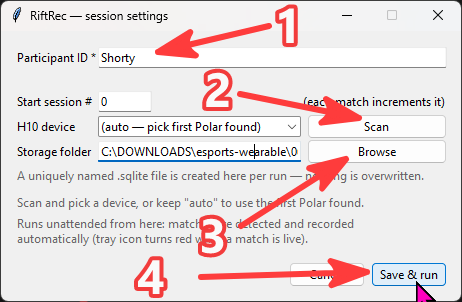
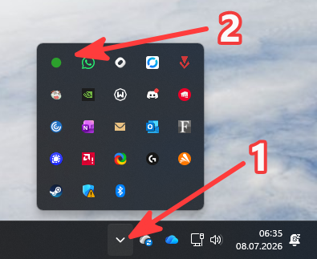
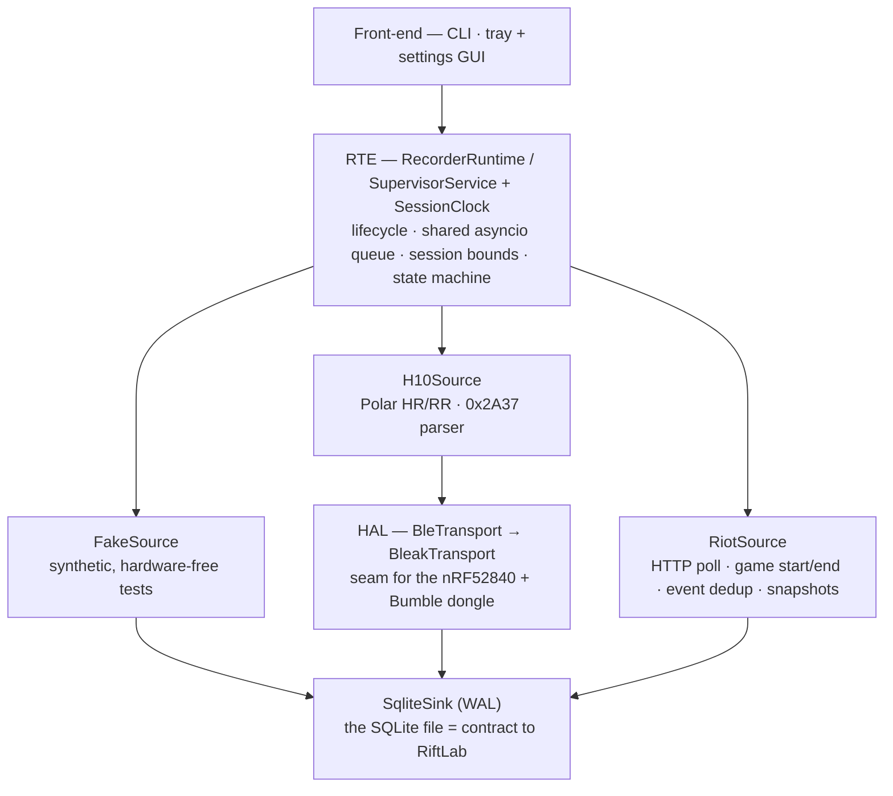

# RiftRec

RiftRec is a hands-off PC recorder for esports-performance sessions. It reads live
**heart rate / RR** from a **Polar H10** chest strap (Bluetooth) together with in-game
events from the **Riot Live Client Data API**, time-synchronises both, and writes each
match to a single SQLite file that the **RiftLab** analysis tool reads. Once started it
runs unattended in the system tray: it detects match start and end on its own and records
one session per match.

---

# Pilot guide (Windows)

Three steps: **download** the app, **pair** the Polar H10 once, then **start** recording.

> **Before you start:** put the chest strap on and **moisten the electrodes** (the two
> ribbed pads on the inside). A dry H10 lying on the desk does not transmit and will not
> be found.

## 1 · Download



On the RiftRec GitHub page, click the green **Code** button (1), then **Download ZIP** (2).
There is no separate release — the ZIP of the `main` branch *is* the app. Unzip it to a
permanent location (e.g. your Documents folder); you get a **`RiftRec-main`** folder.

## 2 · Pair the Polar H10 in Windows (once)

Pairing the strap once lets Windows recognise it. Afterwards it will show as
"Not connected" — that is correct; RiftRec connects to it itself.



Open Windows **Settings → Bluetooth & devices** (1). Make sure Bluetooth is **On** (2),
then click **Add device** and choose **Bluetooth** in the dialog (3).



If the H10 is not listed right away, click **Show all devices** to open the full,
unfiltered list.



Pick **Polar H10 &lt;serial&gt;** from the list (here `Polar H10 1C4BA330`). If it does not
appear, check again that the strap is worn and the electrodes are moistened.



Wait for **"Your device is ready"** and click **Done**. The H10 will then show
**"Not connected"** in the device list — this is normal and expected. RiftRec establishes
the connection itself when you start recording.

## 3 · Start recording



Open the unzipped **`RiftRec-main`** folder and double-click **`Start RiftRec.bat`**.



Windows shows a security warning because the file is not signed. Untick **"Always ask
before opening this file"** (1) and click **Run** (2). On the very first launch RiftRec then
installs what it needs, which takes about a minute (needs internet); later launches start
immediately.



In the settings window, type your **Participant ID** (1, required — your personal study
code). Leave **Start session #** at 0 and the **H10 device** on *auto* (or click **Scan** to
pick it) (2). Choose a **Storage folder** for the recordings (3), then click **Save & run**
(4). Your participant ID and folder are remembered for next time.



The window closes and RiftRec runs in the system tray. Click the **^** arrow to show hidden
icons (1); the RiftRec icon turns **green** once the H10 is connected and ready (2). It turns
**red** while a match is being recorded. **Right-click** the icon to *add a note* or to *stop
and exit*. Just play — matches are detected and recorded automatically.

## Troubleshooting

- **Tray icon stays amber (connecting):** the strap must be worn with moistened electrodes.
  RiftRec keeps retrying and connects within a few seconds once the H10 advertises — you do
  not need to keep it "Connected" in Windows.
- **Nothing happens / it won't start:** every run writes a log to
  `%APPDATA%\RiftRec\riftrec.log`. Open it (paste that path into the Explorer address bar) —
  the last lines say what went wrong. It's the first place to look when helping remotely.
- **"RiftRec is already running":** only one recorder can run at a time. Check the tray for
  the existing icon.

---

# For developers

## Architecture

Layered so the H10 data source stays swappable (later: a USB dongle) and both streams land
time-synchronised in *one* session:



Core idea: every source timestamps records on **one** `SessionClock` (`mono_ns` precise +
`utc` anchor) and writes under **one** `session_id` into the same SQLite DB. The "merge" of
the streams is therefore a join at analysis time — not a separate step. The HAL boundary is
the *BLE transport* (scan / connect / notify / write), not the Polar semantics: a dongle
swaps only the host BLE stack, not the Polar GATT protocol.

Package `riftrec/`: `rte/` (runtime + state + supervisor), `sources/` (fake / h10 / riot +
`base`), `hal/` (`ble` protocol + `ble_bleak`), `storage/` (`sqlite_sink` + `schema.sql`),
`app/` (tray + settings GUI, launcher glue), plus `clock`, `model`, `config`, `cli`.

## Setup & run

```
pip install -r requirements.txt        # full toolset (tests, spikes, PMD, dongle)

# Hardware-free: synthetic pipe (produces a valid session DB)
python -m riftrec record --source fake --seconds 5 --db demo.sqlite

# Real: H10 + running LoL match, until match end (the Riot source stops the session)
python -m riftrec record --participant P01 --session 3 --source h10,riot --db P01_s3.sqlite

# Hands-off supervisor + tray GUI (what the pilot launcher runs)
python -m riftrec gui
```

Pilots use `Start RiftRec.bat`, which creates a local `.venv`, installs only the recorder
runtime deps (`requirements-recorder.txt` — no PMD/dongle spike packages), and launches the
tray GUI windowless. Participant id + storage folder persist in `%APPDATA%\RiftRec\prefs.ini`;
output is logged to `%APPDATA%\RiftRec\riftrec.log`.

Tests (no H10, no match): `PYTHONPATH=. python -m pytest tests/`, or run a single file, e.g.
`PYTHONPATH=. python tests/test_supervisor.py`.

## Data schema (SQLite = contract to RiftLab)

`riftrec/storage/schema.sql` is authoritative. Tables: `session` (header + `mono_anchor_ns` /
`started_utc` as the mono→UTC anchor, `participant_id`, `active_riot_id`), `hr_sample`,
`rr_interval` (own table, the load-bearing HRV signal), `game_event` (deduplicated by Riot
`EventID`), `game_snapshot` (KDA / CS / gold trend), `gap` (dropout marker). Schema version in
`riftrec/__init__.py:SCHEMA_VERSION`.

## Connecting the Polar H10 — technical notes

The standard **Heart Rate service (HR/RR)** needs no pairing and works at every connect; the
Windows pairing in the pilot guide above just registers the device. bleak does not reconnect
on its own, so the supervisor detects dropouts, logs a `gap`, and re-establishes the link
(a fresh connect + subscribe, since HR needs no bond).

For **raw ECG + acceleration (PMD protocol)** the H10 needs an authenticated/bonded BLE
connection, and on Windows 11 this is **unreliable** — see below. PMD/ECG is therefore
deferred; HR/RR is the reliable MVP basis.

### Known, unresolved: ECG/ACC (PMD) only on the first connect

Reproducibly tested (2026-07-05): raw ECG + acceleration arrive only on the **very first** BLE
connection after a fresh Windows pairing. Every further reconnect returns `SUCCESS` on the
control-point commands but **not a single data notification** — while HR always stays reliable,
and re-pairing does not help. Confirmed ineffective: physical H10 reset, `use_cached_services=False`,
pauses between notify subscriptions, a full reboot, an explicit `client.pair()`. Same pattern
reproduced with SimpleBLE, so the cause is the Windows/WinRT BLE stack, not bleak. No known fix
(see [bleak#1943](https://github.com/hbldh/bleak/issues/1943),
[bleakheart#5](https://github.com/fsmeraldi/bleakheart/issues/5)).

### Known gotcha: BLE scan from a Tkinter thread

`bleak.BleakScanner.discover()` on a thread that has already created a Tkinter window fails with
`BleakError: Thread is configured for Windows GUI but callbacks are not working` — Windows flags
such a thread as a "GUI thread" and bleak's WinRT backend can't deliver scan callbacks there. Fix
used in `app/settings_window.py`: run the scan on a plain background `threading.Thread` and marshal
the result back via `root.after(...)`.

## Folder structure

- `riftrec/` — the recorder package (see Architecture)
- `tests/` — hardware-/match-free tests (parsers, sources via fakes, end-to-end pipe, supervisor)
- `spikes/` — short feasibility checks (not for continuous operation, no formal tests)
  - `h10_ble_scan.py` — pure BLE discovery: is the H10 found?
  - `h10_ping.py` — connects, pulls a few HR/RR + ECG + ACC frames, measures inter-arrival timing
  - `h10_simpleble_probe.py` — cross-check of the PMD bug with SimpleBLE
  - `h10_bumble_probe.py` — talk to the H10 through Google's Bumble user-space stack (needs a USB dongle)
