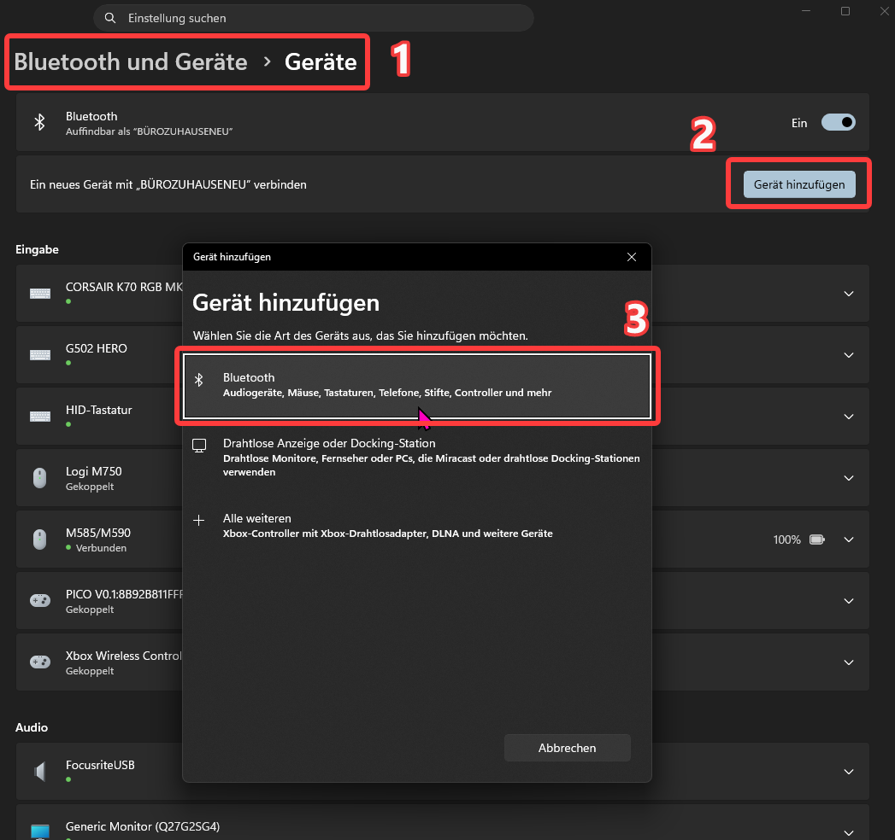
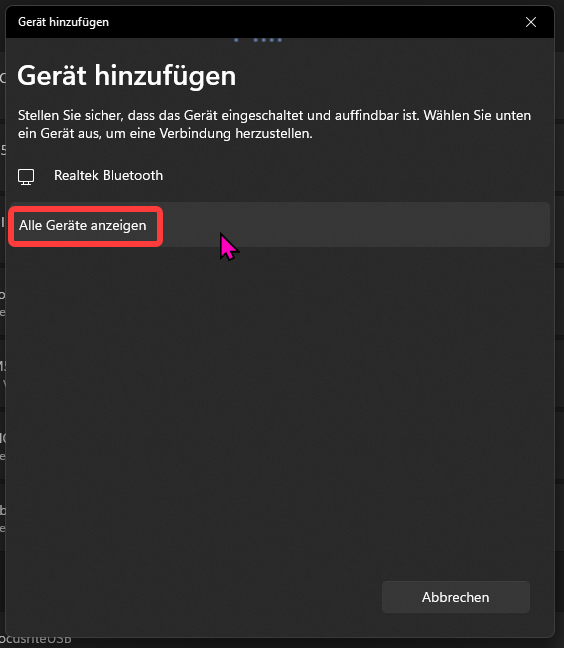
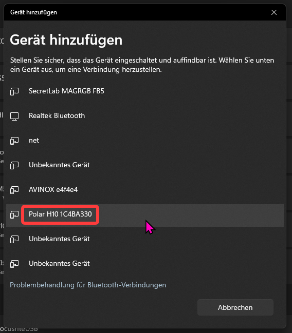
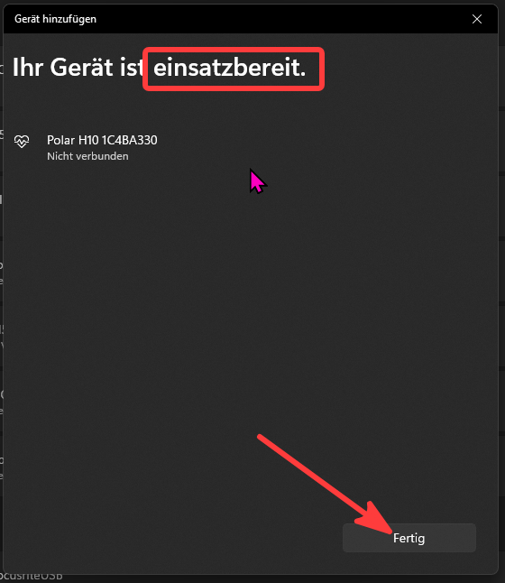
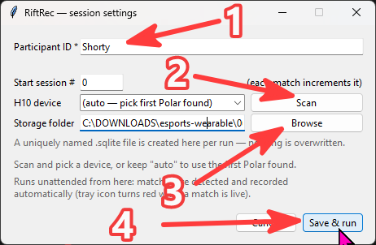
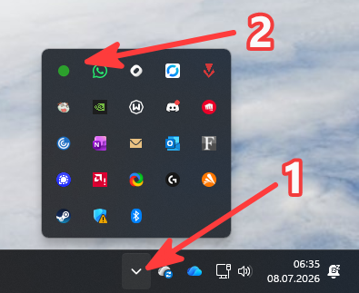
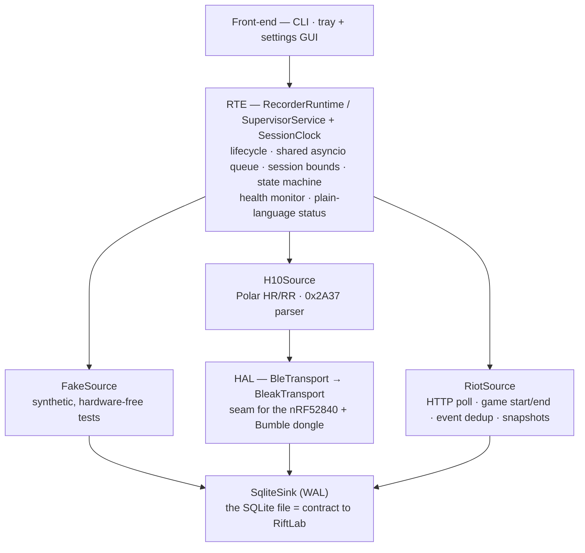

# RiftRec

RiftRec is a hands-off PC recorder for esports-performance sessions. It reads live
**heart rate / RR** from a **Polar H10** chest strap (Bluetooth) together with in-game
events from the **Riot Live Client Data API**, time-synchronises both, and writes each
match to a single SQLite file that the **RiftLab** analysis tool reads. Once started it
runs unattended in the system tray: it detects match start and end on its own and records
one session per match.

---

# Pilot guide (Windows)

Three steps: **download** the app, **pair** the Polar H10 once, then **start** recording.

> **Before you start:** put the chest strap on and **moisten the electrodes** (the two
> ribbed pads on the inside). A dry H10 lying on the desk does not transmit and will not
> be found.

## 1 · Install

Download **`RiftRec-Setup-<version>.exe`** from the
[Releases page](https://github.com/MechatronikMonkey/RiftRec/releases) and run it. That one
file is everything RiftRec needs — no Python, no pip, and no internet connection once it is
downloaded.

Windows will show **"Windows protected your PC"**, because the installer is not code-signed
yet: click **More info**, then **Run anyway**. Installing needs no administrator rights — it
goes into your own user account and adds a **RiftRec** entry to the Start menu.

> RiftRec deliberately does **not** start itself with Windows. Recording is something you
> start on purpose, at the same moment you put the chest strap on.

### If your antivirus objects

RiftRec is **not code-signed yet**, so a scanner that has never seen this program may warn
about it — or quarantine it outright, without asking. It is a false positive: the installer
is built by GitHub Actions from the source in this repository, and every release publishes
the SHA256 of the exact file.

* **The installer takes a long time to appear, or runs twice.** Some scanners
  run an unknown program in a sandbox first and only let it through once it has
  behaved. You then see the setup window twice — once for the sandboxed run,
  once for the real one. Harmless: the second run installs over the first, and
  nothing you have recorded is touched. Just click through both.
* **It only warns:** allow the program and carry on.
* **RiftRec disappeared** — tray icon gone, Start-menu entry dead, nothing running: the
  scanner quarantined it. Restore it from the quarantine, then add an exclusion for the
  installation folder `%LOCALAPPDATA%\Programs\RiftRec`.
* **Either way, please tell us.** This is the one failure RiftRec cannot report itself: if
  the program has been removed, nothing is recorded and nothing says so.

A signed build removes this warning; the certificate has weeks of lead time and is being
sorted out separately.

## 2 · Pair the Polar H10 in Windows (once)

Pairing the strap once lets Windows recognise it. Afterwards it will show as
"Not connected" — that is correct; RiftRec connects to it itself.



Open Windows **Settings → Bluetooth & devices** (1). Make sure Bluetooth is **On** (2),
then click **Add device** and choose **Bluetooth** in the dialog (3).



If the H10 is not listed right away, click **Show all devices** to open the full,
unfiltered list.



Pick **Polar H10 &lt;serial&gt;** from the list (here `Polar H10 1C4BA330`). If it does not
appear, check again that the strap is worn and the electrodes are moistened.



Wait for **"Your device is ready"** and click **Done**. The H10 will then show
**"Not connected"** in the device list — this is normal and expected. RiftRec establishes
the connection itself when you start recording.

## 3 · Start recording

Put the strap on, then open the **Start menu** and click **RiftRec**.



In the settings window, type your **Participant ID** (1, required — your personal study
code). Leave **Start session #** at 0 and the **H10 device** on *auto* (or click **Scan** to
pick it) (2). Choose a **Storage folder** for the recordings (3), then click **Save & run**
(4). Your participant ID and folder are remembered for next time.

Prefer an ordinary local folder. If you pick one that a sync client owns (OneDrive, Dropbox,
…) RiftRec will ask first — such a folder can disappear mid-session when syncing pauses or
you get signed out. If the folder cannot be written to at all, you are told right away
instead of finding out 40 minutes into a game.



The window closes and RiftRec runs in the system tray. Click the **^** arrow to show hidden
icons (1); the RiftRec icon turns **green** once the H10 is connected and ready (2). It turns
**red** while a match is being recorded. Just play — matches are detected and recorded
automatically.

**If you are ever unsure whether it is working, ask it.** Hover the icon, or right-click it:
the top two lines say what RiftRec is doing *and why* in plain words — for example
*"Chest strap not found — put the H10 on and moisten the electrodes, then give it a moment;
RiftRec keeps trying (attempt 12)."* **Show status…** (or a double-click on the icon) opens
the same thing in a window, together with the folder your recordings are going to. The rest
of the menu is *Add note…* and *Stop and exit*.

**And it speaks up by itself.** Some problems look exactly like everything working — the app
is running, the icon is there, you are playing, and nothing is being recorded. When RiftRec
notices one of those it shows a Windows notification saying what happened and what to do,
and the tray icon changes from a dot to an **orange triangle**:

| What you see | What it means |
|---|---|
| *No heart rate* | The match is being recorded but nothing is coming from the strap. |
| *Chest strap lost skin contact* | The strap is connected but no longer reading you — push it down, moisten the electrodes. |
| *League is running, RiftRec sees no game* | Nothing is being recorded. **Please tell us** — this one you cannot fix. |
| *RiftRec cannot save* | The storage folder is unreachable. Data is held in memory until it is back. |

The triangle means "still running, but what is being recorded is not usable". Fix the cause
and it turns back into a dot on its own.

**Watch the battery.** Hovering the tray icon, and the first line of the right-click menu,
show the strap's remaining battery — e.g. `Battery: 74%`. Below 30% it reads
**"replace soon"**. Change the coin cell (CR2025) at that point rather than running it to
zero: a strap that dies mid-match costs the whole session. The value refreshes about every
15 minutes while the strap is connected.

## Troubleshooting

- **Tray icon stays amber (connecting):** hover it or open **Show status…** — it names the
  reason. Usually the strap is not worn or the electrodes are dry; RiftRec keeps retrying and
  connects within seconds once the H10 advertises. You do **not** need it to show as
  "Connected" in Windows' Bluetooth list.
- **Nothing happens / it won't start:** every run writes a log to
  `%APPDATA%\RiftRec\riftrec.log`. Open it (paste that path into the Explorer address bar) —
  the last lines say what went wrong. It's the first place to look when helping remotely.
- **"RiftRec is already running":** only one recorder can run at a time. Check the tray for
  the existing icon.
- **RiftRec is simply gone:** no tray icon, no Start-menu entry. Almost always the antivirus
  — see [If your antivirus objects](#if-your-antivirus-objects). RiftRec cannot warn you
  about this one, because it is no longer there to warn you.
- **No file where you expected one:** a run that never recorded a match deletes its own
  (empty) `.sqlite` again, so only files with real data stay in your folder. **Show status…**
  tells you how many matches this run has recorded.
- **Orange triangle in the tray:** RiftRec is running but something makes the recording
  unusable. Hover it or open **Show status…** for the reason — it is one of the four in the
  table above.
- **"League is running, RiftRec sees no game":** RiftRec cannot reach the game's live data
  (`127.0.0.1:2999`). An overlay, a firewall or a VPN is the usual cause. Nothing is being
  recorded while this shows, so please report it rather than playing on.

**Send your files early.** Send the first recording right after your first session rather
than collecting them — if something is silently not working, that is how we find out in a
day instead of at the end of the study, when those games can no longer be replayed.

---

# For developers

## Architecture

Layered so the H10 data source stays swappable (later: a USB dongle) and both streams land
time-synchronised in *one* session:


```mermaid
flowchart TD
    FE["Front-end — CLI · tray + settings GUI"]
    RTE["RTE — RecorderRuntime / SupervisorService + SessionClock<br/>lifecycle · shared asyncio queue · session bounds · state machine<br/>health monitor · plain-language status"]
    Fake["FakeSource<br/>synthetic, hardware-free tests"]
    H10["H10Source<br/>Polar HR/RR · 0x2A37 parser"]
    HAL["HAL — BleTransport → BleakTransport<br/>seam for the nRF52840 + Bumble dongle"]
    Riot["RiotSource<br/>HTTP poll · game start/end · event dedup · snapshots"]
    Sink["SqliteSink (WAL)<br/>the SQLite file = contract to RiftLab"]

    FE --> RTE
    RTE --> Fake
    RTE --> H10
    RTE --> Riot
    H10 --> HAL
    Fake --> Sink
    HAL --> Sink
    Riot --> Sink
```

Core idea: every source timestamps records on **one** `SessionClock` (`mono_ns` precise +
`utc` anchor) and writes under **one** `session_id` into the same SQLite DB. The "merge" of
the streams is therefore a join at analysis time — not a separate step. The HAL boundary is
the *BLE transport* (scan / connect / notify / write), not the Polar semantics: a dongle
swaps only the host BLE stack, not the Polar GATT protocol.

Package `riftrec/`: `rte/` (runtime + state + supervisor, plus `status` and `health`),
`sources/` (fake / h10 / riot / `game_process` + `base`), `hal/` (`ble` protocol +
`ble_bleak`), `storage/` (`sqlite_sink` + `schema.sql`), `app/` (tray, settings and status
windows, launcher glue), plus `clock`, `model`, `config`, `cli`.

### Watching for silent failure

The recorder runs unattended on machines nobody is watching, so the failure that matters is
not a crash — it is a session that looks fine and contains nothing usable. Two modules exist
only for that:

* **`rte/status.py`** — what the recorder is doing *and why*, in one place, rendered by both
  the tray and the status window. Colour alone is not an explanation.
* **`rte/health.py`** — pure detectors (`Signals` in, `Issue` set out; `now` is a parameter,
  so every threshold is testable without waiting). The supervisor calls them each tick and
  announces only the *edges*, so a persistent problem produces one notification rather than
  one per second. Thresholds live in `health.Thresholds` and are deliberately generous: a
  false alarm mid-game costs more trust than it saves data.

`sources/game_process.py` exists for the nastiest case: the Live Client Data API going
silent looks identical whether nobody is playing or a match is running that we cannot see.
The presence of `League of Legends.exe` is what tells those apart.

Two failure modes are **not** covered and cannot be: an antivirus removing the executable
(the program is gone, it cannot report), and a participant never sending their files. Both
are protocol problems — a short return cadence, not more software.

## Setup & run

```
pip install -r requirements.txt        # full toolset (tests, spikes, PMD, dongle)

# Hardware-free: synthetic pipe (produces a valid session DB)
python -m riftrec record --source fake --seconds 5 --db demo.sqlite

# Real: H10 + running LoL match, until match end (the Riot source stops the session)
python -m riftrec record --participant P01 --session 3 --source h10,riot --db P01_s3.sqlite

# Hands-off supervisor + tray GUI (what the pilot launcher runs)
python -m riftrec gui
```

Pilots get the installer (see below). `Start RiftRec.bat` is the source-checkout
equivalent: it creates a local `.venv`, installs only the recorder runtime deps
(`requirements-recorder.txt` — no PMD/dongle spike packages), and launches the tray GUI
windowless. Participant id + storage folder persist in `%APPDATA%\RiftRec\prefs.ini`; output
is logged to `%APPDATA%\RiftRec\riftrec.log`.

Tests (no H10, no match): `PYTHONPATH=. python -m pytest tests/`, or run a single file, e.g.
`PYTHONPATH=. python tests/test_supervisor.py`.

## Contributing and releases

`main` is protected and takes no direct pushes: every change goes through a branch and a
pull request, where two checks have to pass — `tests` (the full suite) and `installer`
(freeze, self-check, compile, and upload an installable build of that branch).

A release is one tag. Bump `__version__` in a pull request, then:

```
git switch main && git pull
git tag v0.2.0 && git push origin v0.2.0
```

[`release.yml`](.github/workflows/release.yml) verifies that the tag matches `__version__`
and sits on `main`, runs the tests, builds the installer, and publishes it as a GitHub
release with its SHA256. The version is not cosmetic: every recording stores it in
`session.app_version`, so a mislabelled build makes it impossible to tell later which
software produced which data.

Full rules, branch naming, commit convention and the one-off repository setup:
[CONTRIBUTING.md](CONTRIBUTING.md).

## Building the installer (EW-89)

```
powershell -ExecutionPolicy Bypass -File packaging\build.ps1
```

PyInstaller freezes the app into `dist\RiftRec\` (one folder, with a private CPython), Inno
Setup wraps that into `dist\RiftRec-Setup-<version>.exe`. The same steps run in CI — see
[packaging/README.md](packaging/README.md) for the details, including how to plug in a
code-signing certificate once it arrives.

The build's own smoke test is `RiftRec.exe selfcheck`: it imports everything the recorder
touches at runtime and checks that `schema.sql` made it into the bundle, then exits 0 or 1.
That catches the one failure a frozen build hides well — a dependency PyInstaller did not
see, which on a participant's PC looks like a window that simply never opens.

## Data schema (SQLite = contract to RiftLab)

`riftrec/storage/schema.sql` is authoritative. Tables: `session` (header + `mono_anchor_ns` /
`started_utc` as the mono→UTC anchor, `participant_id`, `active_riot_id`), `hr_sample`
(incl. `contact`), `rr_interval` (own table, the load-bearing HRV signal), `game_event`
(deduplicated by Riot `EventID`), `game_snapshot` (KDA / CS / gold trend), `gap` (dropout
marker), plus the raw channels `hr_raw` and `game_raw`. Schema version in
`riftrec/__init__.py:SCHEMA_VERSION`.

`gap.source` says what was lost, and is worth reading before trusting a stretch of signal:

| `source` | Meaning |
|---|---|
| `h10` | The BLE link was down — no heart rate at all for that interval. |
| `h10_contact` | The link was up but the strap was not reading the skin: RR intervals stopped while `hr_bpm` kept reporting a **frozen** value. Everything inside such a gap must be discarded, even though it looks like ordinary data (see below). |

`h10_contact` is a new *value*, not a new column, so it needs no schema version — but an
analysis that filters on `source = 'h10'` will silently miss it.

### Raw channels — nothing is discarded at capture time

The parsed tables are a convenience view. What the sources actually deliver is kept verbatim,
so that an analysis nobody thought of today is still possible later:

* **`hr_raw`** — every unparsed 0x2A37 notification. Makes a parser bug recoverable and keeps
  fields we do not decode (e.g. Energy Expended).
* **`hr_sample.contact`** — BLE sensor contact status: `1` skin contact, `0` none, `NULL` when
  the device does not report it. Per BLE spec the "detected" bit is only meaningful together
  with the "supported" bit; both are read together, so a device without the feature yields
  `NULL` rather than a fake "no contact".

#### Detecting contact loss on the Polar H10

**The H10 does not report contact status** — verified 21.08.2026, flags byte `0x10`, the
contact-supported bit is never set. `contact` therefore stays `NULL` with our hardware. The
column is kept because it is spec-compliant and other devices do populate it.

Use the **RR channel** instead. A measured 120 s recording with the strap disturbed and then
removed shows a three-stage failure:

| Phase | Flags | `hr_bpm` | RR |
|---|---|---|---|
| contact | `0x10` | varies (67–71) | present |
| disturbed / lost | `0x00` | **frozen at last value** | none |
| strap off | `0x00` | `0` | none |

The middle phase is the trap: for ~10 seconds the device keeps emitting a **plausible but
frozen** heart rate that is indistinguishable from a real measurement in the `hr_sample` series
alone. A brief disturbance is enough to trigger it — the strap does not have to come off, which
is exactly the failure mode a multi-hour unattended session will produce.

So: **a window is trustworthy only if RR intervals are present throughout it.** `hr_bpm = 0` is
a valid but late signal, and a bit-for-bit constant `hr_bpm` over several seconds is a useful
cross-check. Note that an artefact-correction rate will *not* catch this — a frozen stretch
contains no correctable beats at all.
* **`device_info`** — identity and state of the sensor, written once per session:
  serial number, hardware/firmware/software revision, BLE address and battery
  level. With straps rotating between participants this is the only way to trace
  a recording back to a physical unit, and the firmware version matters because
  Polar changed BLE behaviour within the 4.x line. Battery is captured per
  session because a weak cell is a plausible confounder for signal quality.
  Every field is optional — a failed read never aborts a recording.
* **`game_raw`** — the complete `allgamedata` response as zlib-compressed JSON, stored on the
  first poll, then every `raw_interval_s` (default 30 s), plus the final frame before
  `GameEnd`. Holds everything the parsed tables drop: champion, position, team, items, runes,
  `respawnTimer` and the full scoreboard of all ten players. Compressed this is ~300 kB per
  match; uncompressed at snapshot cadence it would be ~16 MB, which does not fit a manual
  e-mail return path.

**Pseudonymisation.** `allgamedata` carries the Riot IDs of all ten players — nine of whom
never consented to anything. Before storage, foreign names are replaced by a session-salted
hash (`p_<12 hex>`) consistently across `game_raw` and `game_event.payload_json`, so kill and
death attribution still works; bare `riotIdTagLine` values are cleared. The recording player's
own id is left readable, since RiftLab uses it to tell own events from enemy ones.

Reading a raw frame: `json.loads(zlib.decompress(blob))`, or
`riftrec.sources.riot.decompress_game_data`.

## Connecting the Polar H10 — technical notes

The standard **Heart Rate service (HR/RR)** needs no pairing and works at every connect; the
Windows pairing in the pilot guide above just registers the device. bleak does not reconnect
on its own, so the supervisor detects dropouts, logs a `gap`, and re-establishes the link
(a fresh connect + subscribe, since HR needs no bond).

For **raw ECG + acceleration (PMD protocol)** the H10 needs an authenticated/bonded BLE
connection, and on Windows 11 this is **unreliable** — see below. PMD/ECG is therefore
deferred; HR/RR is the reliable MVP basis.

### Known, unresolved: ECG/ACC (PMD) only on the first connect

Reproducibly tested (2026-07-05): raw ECG + acceleration arrive only on the **very first** BLE
connection after a fresh Windows pairing. Every further reconnect returns `SUCCESS` on the
control-point commands but **not a single data notification** — while HR always stays reliable,
and re-pairing does not help. Confirmed ineffective: physical H10 reset, `use_cached_services=False`,
pauses between notify subscriptions, a full reboot, an explicit `client.pair()`. Same pattern
reproduced with SimpleBLE, so the cause is the Windows/WinRT BLE stack, not bleak. No known fix
(see [bleak#1943](https://github.com/hbldh/bleak/issues/1943),
[bleakheart#5](https://github.com/fsmeraldi/bleakheart/issues/5)).

### Known gotcha: BLE scan from a Tkinter thread

`bleak.BleakScanner.discover()` on a thread that has already created a Tkinter window fails with
`BleakError: Thread is configured for Windows GUI but callbacks are not working` — Windows flags
such a thread as a "GUI thread" and bleak's WinRT backend can't deliver scan callbacks there. Fix
used in `app/settings_window.py`: run the scan on a plain background `threading.Thread` and marshal
the result back via `root.after(...)`.

## Folder structure

- `riftrec/` — the recorder package (see Architecture)
- `packaging/` — installer build: PyInstaller spec, Inno Setup script, icon generator, `build.ps1`
- `tests/` — hardware-/match-free tests (parsers, sources via fakes, end-to-end pipe, supervisor)
- `spikes/` — short feasibility checks (not for continuous operation, no formal tests)
  - `h10_ble_scan.py` — pure BLE discovery: is the H10 found?
  - `h10_ping.py` — connects, pulls a few HR/RR + ECG + ACC frames, measures inter-arrival timing
  - `h10_simpleble_probe.py` — cross-check of the PMD bug with SimpleBLE
  - `h10_bumble_probe.py` — talk to the H10 through Google's Bumble user-space stack (needs a USB dongle)

---

## Licence

MIT — see [LICENSE](LICENSE). Use it, change it, build on it; keep the copyright
notice.

The licence covers the **software only**. Session recordings are never part of
this repository (`*.sqlite` is gitignored) and are not covered — they are
Art. 9 GDPR health data belonging to the study participants.

Dependencies are permissively licensed: bleak (MIT), httpx (BSD), pystray
(LGPL, used unmodified as a library), pillow (MIT-CMU).
